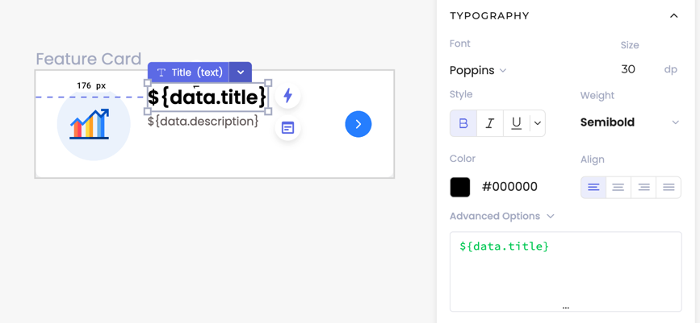

# Codelessly CloudUI™ SDK
[](https://pub.dev/packages/codelessly_sdk) [](https://github.com/Codelessly/CodelesslySDK) [](https://github.com/Codelessly/CodelesslySDK/issues) [](https://github.com/Codelessly/CodelesslySDK)


> ### Dynamic UI and real-time updates for Flutter apps

Supercharge your Flutter apps with dynamic UI and real-time updates. Build and publish UI without code!

- **Real-Time UI Updates:** Adjust your UI as often as you need, all in real-time. Adapt to trends, feedback, and business needs on the fly.
- **Intuitive UI Editor:** Easily create and update UI with our user-friendly Codelessly Editor.
- **Empower Non-Technical Team Members:** Enable anyone on your team to build UI without learning how to code.

## Quickstart
[](https://pub.dev/packages/codelessly_sdk)

#### Step 1: Import Library

Import this library into your project:
```yaml
codelessly_sdk: ^latest_version
```

#### Step 2: Initialize the SDK

Initialize Codelessly before calling `runApp()`.

```dart
void main() {
  WidgetsFlutterBinding.ensureInitialized();
  
  // Initialize SDK.
  Codelessly.initialize(
    config: const CodelesslyConfig(
      authToken: AUTH_TOKEN,
      isPreview: kIsDebug,
    ),
  );

  runApp(const MyApp());
}
```
The `authToken`can be found for each project under `Publish > Settings > Settings`.

Information on customizing SDK initialization can be found later in the documentation.

#### Step 3: Get a Layout ID from the Codelessly Editor

Easily embed a design from the Codelessly Editor into your app with a `layoutID`. The `CodelesslyWidget` enables your app to update its UI over the air.

```dart
CodelesslyWidget(
  layoutID: LAYOUT_ID,
)
```

1. In the Codelessly Editor, select the **canvas** of your layout.
2. Press the **Preview Icon** in the toolbar. 
3. Copy the **layoutID**.


Refer to the later sections for how to pass variables and functions to the CodelesslyWidget.

#### Full Example: Putting it All Together

The `CodelesslyWidget` can be used like any other widget and embedded anywhere in your app. It can even be used to render entire pages as the root widget!

Here is a complete example:

```dart
import 'package:codelessly_sdk/codelessly_sdk.dart';

class MyApp extends StatelessWidget {
  const MyApp({Key? key}) : super(key: key);

  @override
  Widget build(BuildContext context) {
    return MaterialApp(
      title: 'Codelessly SDK Example',
      home: CodelesslyWidget(
        layoutID: LAYOUT_ID,
      ),
    );
  }
}
```

From dynamic forms to constantly changing sales and marketing pages, any design or layout can be streamed to your app via the `CodelesslyWidget`. 

To learn how to use the Codelessly editor to publish layouts, check out our [3-minute Quickstart Guide](https://app.gitbook.com/o/rXXdMMDhFOAfV2g6j8A1/s/x4NeiXalJWaOaV6tsK5f/getting-started/3-minute-quick-start).

## Configuring Environments

The CodelesslyWidget supports **Preview** and **Published** environments via the `isPreview` boolean.

```dart
// Global config.
Codelessly.initialize(
  config: const CodelesslyConfig(
    isPreview: true,
  ),
);

// Widget level. Overrides global settings for this widget.
CodelesslyWidget(
  isPreview: true
)
```

### Preview Mode

> Realtime UI updates - edits made in the Codelessly Editor are mirrored immediately to the app.

When `isPreview` is set to true, the CodelesslyWidget will stream UI updates from the Codelessly Editor in realtime. Any edits to the UI in the editor will update in the app immediately. It's a pretty amazing feature, give it a try and let us know how you're using it!

Use preview mode to quickly test UI and prototype. 

#### Flavor Support

A common request is to enable Preview mode in QA environments to support updating the UI on test user's devices. That can be done by setting the `isPreview` value based on the flavor or runtime environment.

```dart
// Global config.
Codelessly.initialize(
  config: const CodelesslyConfig(
    isPreview: FlavorConfig.flavor != "prod",
  ),
);
```

This enables realtime updates on release devices in a test environment, excluding production.

### Production Mode

> Publish UIs with absolute control over updates and versioning.

`isPreview` should be set to false for production environments to prevent the UI from changing. When running in Publish (aka Production) mode, UI changes must be explicitly published to update the UI. This makes working in the editor safe and prevents undesired changes from reaching end users.

**Note:** You do not need to change layoutIDs from Preview to Production. Canvases have a single unique layoutID identifies itself in the system. Codelessly Servers automatically handles loading the correct layout from Preview or Production. 

## CodelesslyWidget Customization

```dart
CodelesslyWidget(
      layoutID: '0R0Qe7wgeAJMnj3MGW4l',
      isPreview: kDebugMode,
      config: const CodelesslyConfig(
        authToken: 'LCVyNTxyLCVxQXh3WDc5MFowLjApQXJfWyNdSnlAQjphLyN1',
      ),
    )
```

- `layoutID`: The ID of the published canvas. The ID can be found in Quick Preview or under `Publish > Settings > Published Layouts`.


- `isPreview`: Whether the layout is in preview or production mode. Preview mode is meant for debugging the layout and syncs with the changes made in the editor. Widgets in production mode are only updated when published using the Publish button.
- `config`: An optional `CodelesslyConfig` that holds the information required to authenticate your layout from the server.

**Note:** Setting a `CodelesslyConfig` overrides the global project settings. This enables using layouts from other projects with different auth tokens and settings.

## Data

Customize remote UI by passing data into your layout. The UI will dynamically replace any variables defined in the Codelessly editor with the appropriate provided value.

### Using data with UI



**Step 1:** Use the `${}` templating syntax in input fields to link data from the Codelessly editor to layouts as shown below. 

To link the title of a text widget to the `title` variable in the Codelessly editor, put `${data.title}` in the text widget’s text field.

> The `data` object contains all the variables passed to the CodelesslyWidget. 
>
> Use `${data.title}` to access the `title` variable passed from the client. `${title}` alone is a Codelessly variable and will try to load variables defined in Codelessly, not your client.

**Step 2:** Once this is set from the editor, you can provide the data to the layout from your app.

```dart
CodelesslyWidget(
  layoutID: '<YOUR LAYOUT ID HERE>',
  data: {
    'title': 'Fast Performance',
    'description': 'Complete projects on time and easily with our APIs. Get blazing fast performance!',
  },
),
```

Here, `data` parameter is a map of type `Map<String, dynamic>` which is used to populate information in the layout UI where `data`
variable is used from the Codelessly editor. The layout UI will automatically update to reflect the new data whenever
the `data` is updated.

This how it looks with populated data:


## Functions

Codelessly SDK also supports providing callback functions for user actions on the UI like onClick, onLongPress, etc.

Use `Call Function` action to define an external function call for an action. For example, here, we are defining a
function call for the `onClick` action of the `Button` widget.

1. Select your button and navigate to `Develop` see bring up the `Actions` panel.
2. Click on the `+` button to add a new action.
3. Select `Call Function` from the list of actions.
4. Click on the `Settings` button to bring up the `Action Settings` popup.
5. Write a valid function name in the `Function Name` field. For example, `myFunction`.


Here, we defined `onNextButtonClicked` function call action of the button widget when the button is clicked.
Implementation for this `onNextButtonClicked` function callback can be provided in the `functions` parameter of the
`CodelesslyWidget` as shown below.

```dart
CodelesslyWidget(
  layoutID: 'YOUR LAYOUT ID HERE',
  data: {
    'title': 'Fast Performance',
    'description': 'Complete projects on time and easily with our APIs. Get blazing fast performance!',
  },
  functions: {
    'onNextButtonClicked': CodelesslyFunction((CodelesslyContext context) {
      print('onNextButtonClicked function called');
      // TODO: Implement your function here
    }),
  },
),
```

Here, `functions` parameter takes a map of type `Map<String, CodelesslyFunction>` which is used to execute functions 
defined as action calls in the Codelessly editor. This will be called when user clicks on the button. 

The `CodelesslyFunction` takes in a `CodelesslyContext` which provides you the access to data, variables, conditions, 
functions and much more.

> Similarly, you can declare `data` and `functions` in the global `Codelessly` instance to make them globally accessible by all `CodelesslyWidget`s.

### Initializing the SDK
There are several ways to initialize your `CodelesslyWidget`.

#### Method #1: Lazy Initialization using the CodelesslyWidget
The simplest method is to directly use the `CodelesslyWidget` and allow it to initialize itself automatically when it
comes into view in your widget tree. If you use this method, you **must** provide the `authToken` in a 
`CodelesslyConfig` in the `config` constructor parameter of the `CodelesslyWidget`.

```dart
import 'package:codelessly_sdk/codelessly_sdk.dart';

class MyApp extends StatelessWidget {
  const MyApp({Key? key}) : super(key: key);

  @override
  Widget build(BuildContext context) {
    return MaterialApp(
      title: 'Codelessly SDK Example',
      home: CodelesslyWidget(
        layoutID: 'YOUR LAYOUT ID HERE',
        config: const CodelesslyConfig(
          authToken: 'YOUR AUTH TOKEN HERE',
        ),
      ),
    );
  }
}
```

The global `Codelessly` instance will be configured for you automatically using this method. The first time you load 
data, you may see an empty loading state while the SDK attempts to download all the necessary information; 
subsequent attempts will be instantaneous as the caching system kicks in.

> Subsequent attempts should be instantaneous as the caching system kicks in.

#### Method #2: Preemptive Initialization using the Codelessly global instance

To initialize the SDK before rendering any `CodelesslyWidget`, perform the initialization through the global 
`Codelessly` instance. To do this, Simply call the `Codelessly.initialize` method before you render any 
`CodelesslyWidget`. Ideally, call it in the `main` method.

```dart
import 'package:codelessly_sdk/codelessly_sdk.dart';

void main() async {
  await Codelessly.initialize(
    config: const CodelesslyConfig(
      authToken:'YOUR AUTH TOKEN HERE',
    ),
  );

  runApp(const MyApp());
}

class MyApp extends StatelessWidget {
  const MyApp({Key? key}) : super(key: key);

  @override
  Widget build(BuildContext context) {
    return MaterialApp(
      title: 'Codelessly SDK Example',
      home: CodelesslyWidget(
        layoutID: 'YOUR LAYOUT ID HERE',
      ),
    );
  }
}
```

The `Codelessly.initialize()` method takes in several parameters to provide more  flexibility and control. 
For example, you can declare your `CodelesslyConfig` in this method to make it the default configuration of all 
`CodelesslyWidget`s, unless explicitly overridden.

### CodelesslyConfig

The CodelesslyConfig provides you with additional configuration capabilities to the SDK.

* `isPreview`: Globally enable or disable preview-mode from the SDK.
* `preload`: Determines if the SDK should preload all of the published layouts of a given Codelessly project. This allows you to provision your entire project ahead of time instead of lazily as `CodelesslyWidget`s render into view and individually download their data.
* `automaticallyCollectCrashReports`: By default, any crashes or errors are sent to Codelessly’s servers for analysis. You can optionally disable this behavior.

### Customize Initialization

Initialization method `initialize` takes in several parameters to provide complete flexibility. For example, you 
can declare config in this method to make it the default configuration of all 
`CodelesslyWidget`s, unless overridden.

```dart
Codelessly.initialize(
  config: const CodelesslyConfig(
    authToken: authToken,
    isPreview: kIsDebug,
  ),
);
```

Similarly, you can declare `data` and `functions` to make them globally accessible.

## Demo
### [CodelesslyGPT](https://sdk-chat-bot.web.app/#/)
A demo chat-bot interface built with the Codelessly SDK. [View Code](https://github.com/Codelessly/CodelesslySDK/tree/main/example_chat_bot)

## Additional Resources
Additional resources and tutorials are on our [documentation website](https://app.gitbook.com/o/rXXdMMDhFOAfV2g6j8A1/s/x4NeiXalJWaOaV6tsK5f/getting-started/3-minute-quick-start).

If you have any questions or run into any issues, please open an issue or email us at [codelessly@gmail.com](mailto:codelessly@gmail.com).

For the latest information on releases and product updates, subscribe to our newsletter on the [Codelessly Website](https://codelessly.com/).